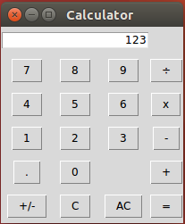
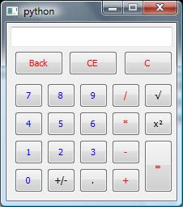

## Learn-Tkinter

Learn the Basics of making GUI using tkinter and implement it in making designs for On-screen Keyboard, Calculator and TV Remote.

For the requirements of this project, you can use either Tkinter widgets or the modern Ttk Widgets.

### Guidelines
* The widget should work in both Windows and Linux environment
* The Buttons, labels and text boxes should be properly spaced and aligned
* The height and width of the Tk window should be fixed

### GUI Samples

The following samples are provided for reference:

* Calculator:

* On-screen Keyboard

* Remote

